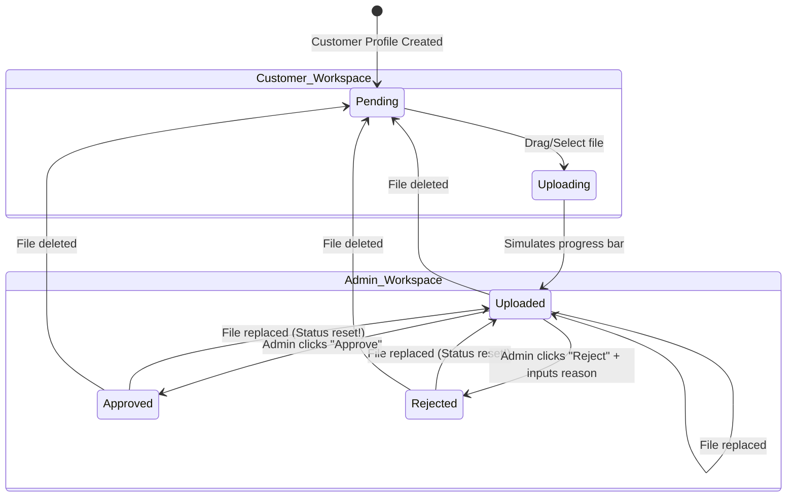
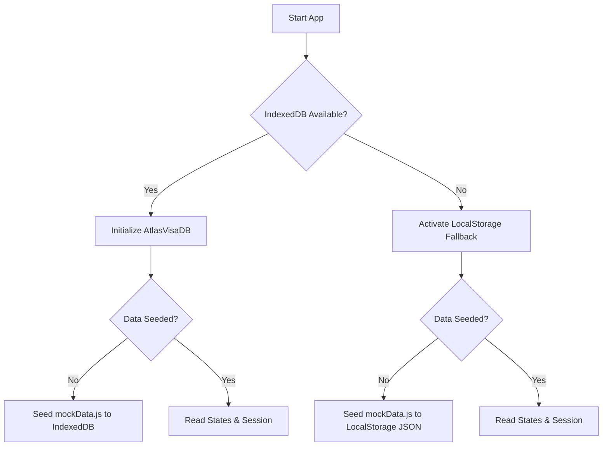

# Travel & Visa Portal: Professional Brainstorming & Architecture Analysis

An in-depth UI/UX and system engineering blueprint for a professional travel document portal and CRM application.

---

## 1. UI/UX Design System (Frontend Perspective)

### Typography & Spacing
- **Font Stack**: `Inter` or `Outfit` from Google Fonts. Font-weights configured: Regular (400), Medium (500), Semi-Bold (600), Bold (700), Extrabold (800).
- **Harmonious Color Palette**:
  - Primary / Brand: Maritime Blue (`#1d4ed8` - `blue-700` to `#3b82f6` - `blue-500`) representing trust, security, and global travel.
  - Success: Emerald Green (`#047857` - `emerald-700` to `#10b981` - `emerald-500`) for approved documentation and success timelines.
  - Warning/Rejection: Rose Red (`#be123c` - `rose-700` to `#f43f5e` - `rose-500`) for rejected slots requiring user attention.
  - Intermediate/Alert: Amber Orange (`#b45309` - `amber-700` to `#f59e0b` - `amber-500`) for reviews.
  - Neutral Backgrounds: Slate/Gray (`#f8fafc` - `slate-50` base, `#ffffff` card body, `#0f172a` text-main).
- **Layout & Structure**:
  - `rounded-3xl` for high-level dashboard containers, creating a modern, friendly feeling.
  - `rounded-2xl` for checklist cards, timeline containers, and sidebar items.
  - `rounded-xl` for buttons, inputs, and badges.

### Micro-Interactions & Animations
- **Slide-in Toasts**: Popups slide in from the top-right of the viewport with spring physics (`transform` and `opacity` transition classes) and automatically disappear with smooth fades.
- **Form Error Shake**: Invalid input submissions trigger a structural CSS keyframe animation (`shake 0.4s ease`) that wobbles the card or input field to grab user attention.
- **Drag-and-Drop Active States**: Hovering files over a drop-zone changes the border from dashed slate to solid blue, scales up the upload icon, and shifts the backdrop color.
- **Shimmer Skeletons**: Replacing basic text loaders with shimmering grid blocks (`animate-pulse` gradient bars) during asynchronous IndexedDB connection states.
- **Action Backdrops**: Confirmation modals render with an absolute backdrop blur filter (`backdrop-blur-sm bg-slate-900/40`) to focus focus on the modal action card.

---

## 2. Input Security & Validation Rules (Fullstack Perspective)

### A. Form Checking
1. **Login Credentials**:
   - *Email*: Tested against RFC-compliant Regex (`/^[^\s@]+@[^\s@]+\.[^\s@]+$/`).
   - *Password*: Length must be `>= 4` characters.
2. **Contact Consultation Form**:
   - *Name*: Length `>= 3` characters (rejects numbers or symbols).
   - *Email*: Regex structure check.
   - *Message*: Length `>= 10` characters.
3. **Task Creation Form** (Admin CRM):
   - *Description*: Required, length `>= 3` characters.
   - *Assignee & Due Date*: Checked for selections.

### B. File Upload Verification (Customer Dashboard)
1. **File Type Filter**:
   - Acceptable extensions: `.pdf`, `.png`, `.jpg`, `.jpeg`.
   - MIME checks simulated by inspecting file extension. Any script, executable, or text file will trigger a rejection toast.
2. **File Size Check**:
   - Size limit: `5MB` (`5,242,880 bytes`).
   - Files exceeding the limit are blocked immediately. The upload bar is not shown, and a warning toast displays.

---

## 3. Database State Transition Engine (NoSQL/SQL Logic)

The document and application statuses follow a strict state-machine logic to ensure CRM reliability:

### Overall Application Status Propagation rules:
- If **any** document slot of the customer changes to `'Uploaded'` or `'Under Review'`, the customer's overall `applicationStatus` automatically transitions to `'Under Review'`.
- If **any** document slot is `'Rejected'`, the customer's overall `applicationStatus` transitions to `'Action Required'` (prompting the customer to check the comments/rejection logs).
- If **all** required documents in the checklist have the status `'Approved'`, the customer's overall `applicationStatus` changes to `'Approved'`. The final timeline milestone ("Visa Decision") is marked as complete.

---

## 4. Database Resilience (Storage Engine)

To guarantee a crash-free experience on any browser (even in private/incognito tabs where IndexedDB is blocked by privacy policies), we implement a **Dynamic Fallback Architecture**:

This structural safety check is standard in enterprise web applications to ensure seamless portfolio demonstrations.
